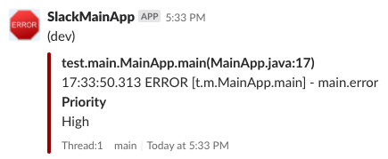

## log4j2 slack appender

log4j2.xml example(1) : default on info level , special class path on warn level , and error level send to slack at the same time
  ```xml
  <?xml version="1.0" encoding="UTF-8"?>
  <Configuration packages="tw.noah.utils.log4j2">
    <Appenders>
      <Console name="Console" target="SYSTEM_OUT">
        <PatternLayout pattern="%d{HH:mm:ss.SSS} %-5level [%logger{1.}.%t] - %msg%n"/>
      </Console>

      <SlackAppender name="slack" webhook="https://hooks.slack.com/services/XXXXXXXX/XXXXXXXX/XXXXXXXXXXXX"
        appName="SlackMainApp"
        errorChannel="#channel1"
        warnChannel="#channel2"
        infoChannel="#channel3"
        environment="dev"
        frequency="3"
      >
        <ThresholdFilter level="error" onMatch="ACCEPT" onMismatch="DENY" />
        <PatternLayout pattern="%d{HH:mm:ss.SSS} %-5level [%logger{1.}.%t] - %msg%n"/>
      </SlackAppender>
    </Appenders>
    <Loggers>
  
      <Logger name="test.main" level="warn" additivity="true">
        <AppenderRef ref="slack"/>
      </Logger>
  
      <Root level="info">
        <AppenderRef ref="Console"/>
      </Root>
    </Loggers>
  </Configuration>
  ```
    
[log4j2.xml](src/main/resources/log4j2.xml) example(2) : default on info level , and error level send to slack at the same time
  ```xml
  <?xml version="1.0" encoding="UTF-8"?>
  <Configuration packages="tw.noah.utils.log4j2">
    <Appenders>
      <Console name="Console" target="SYSTEM_OUT">
        <PatternLayout pattern="%d{HH:mm:ss.SSS} %-5level [%logger{1.}.%t] - %msg%n"/>
      </Console>
  
      <SlackAppender name="slack" webhook="https://hooks.slack.com/services/XXXXXXXX/XXXXXXXX/XXXXXXXXXXXX"
        appName="SlackMainApp"
        errorChannel="#channel1"
        warnChannel="#channel2"
        infoChannel="#channel3"
        environment="dev"
        frequency="3"
      >
        <ThresholdFilter level="error" onMatch="ACCEPT" onMismatch="DENY" />
        <PatternLayout pattern="%d{HH:mm:ss.SSS} %-5level [%logger{1.}.%t] - %msg%n"/>
      </SlackAppender>
    </Appenders>
    <Loggers>
  
      <Root level="info">
        <AppenderRef ref="Console"/>
        <AppenderRef ref="slack"/>
      </Root>
    </Loggers>
  </Configuration>
  ```


- required library:
  - jackson-core-2.x.x.jar
  - jackson-annotations-2.x.x.jar
  - jackson-databind-2.x.x.jar
  - log4j-api-2.x.x.jar
  - log4j-core-2.x.x.jar

- slack appender variables :
  - Required
    - webhook : The Slack incoming webHook url
    - appName : The Application Name , show on message title.
    - errorChannel : The Slack channel where an error occurred.
    - environment : the environment identification word.
  - Optional
    - warnChannel : The Slack channel where a warn occurred.
    - infoChannel : The Slack channel where a info occurred.
    - connectTimeoutSeconds : Send to slack timeout seconds.
    - frequency : The frequency sent to slack per second
    - proxyUrl : The proxy domain or ip , if need to use proxy to connect
    - proxyPort : The proxy port , if need to use proxy to connect
    
    
## log4j.xml using variables
 
- JVM options
  - variables on JVM Options: 
  ```bash
  -Dslack.webHook=https://hooks.slack.com/services/XXXXXXXX/XXXXXXXX/XXXXXXXXXXXX
  ```
  - log4j2.xml
  ```xml
  <SlackAppender name="slack" webhook="${sys:slack.webHook}">
  ``` 

- Customer plugins
  - application.yml or application.yaml
  ```yaml
  log4j:
    slack:
      webHook: 'https://hooks.slack.com/services/XXXXXXXX/XXXXXXXX/XXXXXXXXXXXX'
  ``` 
  - log4j2.xml
  ```xml
  <SlackAppender name="slack" webhook="${yaml:log4j.slack.webHook}">
  ```

- more information :
  [http://logging.apache.org/log4j/2.x/manual/configuration.html#PropertySubstitution](http://logging.apache.org/log4j/2.x/manual/configuration.html#PropertySubstitution)
 

      
    

## result example :

